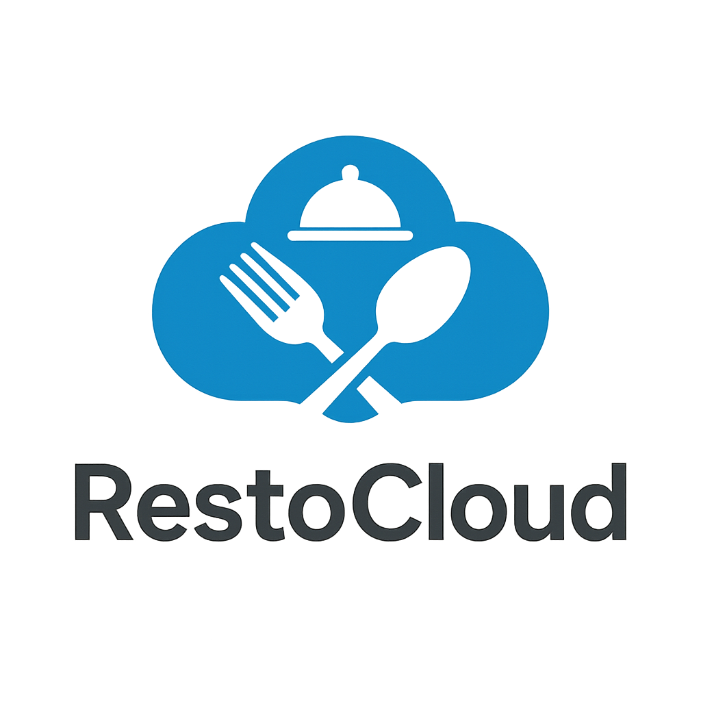

# RestoCloud - Online Restaurant Ordering and Management System

## Project Overview
RestoCloud is a comprehensive web-based restaurant ordering and management system that allows customers to browse menus, place orders, and track their order status. Restaurant administrators can manage menu items, process orders, and handle customer interactions through an intuitive dashboard.

## Features

### Customer Features
- User registration and login system
- Browse food items by categories
- Search functionality for finding specific dishes
- Shopping cart for order management
- Secure checkout process
- Order history and tracking
- Profile management
- Contact form for customer support

### Admin Features
- Secure admin login
- Dashboard with order statistics
- Menu management (add, edit, delete items)
- Order processing and status updates
- Customer message management
- User management

## Technologies Used
- **Frontend**: HTML, CSS, JavaScript
- **Backend**: PHP
- **Database**: MySQL (via phpMyAdmin)
- **Server**: XAMPP (Apache, MySQL)
- **Additional Libraries**: 
  - Font Awesome for icons
  - Swiper.js for image sliders

## Installation and Setup

### Prerequisites
- XAMPP (version 7.4 or higher)
- Web browser (Chrome, Firefox, etc.)
- Git (optional, for cloning the repository)

### Installation Steps

1. **Install XAMPP**
   - Download and install XAMPP from [Apache Friends](https://www.apachefriends.org/index.html)
   - Start the Apache and MySQL services from the XAMPP Control Panel

2. **Clone or Download the Repository**
   - Clone: `git clone https://github.com/yourusername/RestoCloud.git`
   - Or download and extract the ZIP file

3. **Set Up the Project**
   - Move the project folder to the XAMPP htdocs directory:
     - Windows: `C:\xampp\htdocs\RestoCloud`
     - macOS: `/Applications/XAMPP/htdocs/RestoCloud`
     - Linux: `/opt/lampp/htdocs/RestoCloud`

4. **Set Up the Database**
   - Open your browser and navigate to `http://localhost/phpmyadmin`
   - Create a new database named `food_db`
   - Import the database structure from `food_db.sql` file in the project root

5. **Configure Database Connection**
   - Open `components/connect.php`
   - Update the database credentials if necessary (default should work with standard XAMPP installation)

6. **Access the Application**
   - Open your browser and navigate to `http://localhost/RestoCloud/home.php`
   - Admin access: `http://localhost/RestoCloud/admin/admin_login.php`
   - Default admin credentials:
     - Username: admin
     - Password: admin123

## Usage

### Customer Interface
1. Register a new account or log in
2. Browse food items by category or use the search function
3. Add items to your cart
4. Proceed to checkout and complete your order
5. Track your order status from your profile

### Admin Interface
1. Log in with admin credentials
2. Use the dashboard to monitor orders and sales
3. Manage menu items (add, edit, delete)
4. Process customer orders and update their status
5. Respond to customer messages

## Project Structure
- `/admin` - Admin panel files
- `/components` - Reusable PHP components
- `/css` - Stylesheet files
- `/images` - Static image assets
- `/js` - JavaScript files
- `/uploaded_img` - User-uploaded images (products)

## License
This project is licensed under the MIT License - see the LICENSE file for details.

## Contact
For any inquiries or support, please contact [your-email@example.com](mailto:your-email@example.com)

---
© 2025 RestoCloud. All Rights Reserved.
