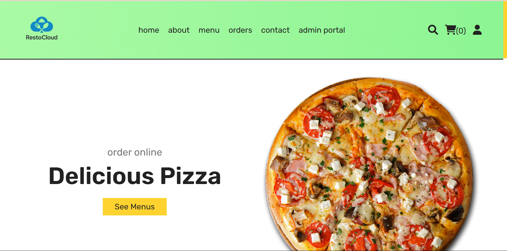

# RestoCloud – Online Restaurant Ordering and Management System

<p align="center">
  
</p>

---

## 📌 Project Overview
**RestoCloud** is a complete web-based restaurant ordering and management platform. It allows customers to browse menus, place orders, and track them, while restaurant admins manage menus, orders, users, and feedback—all through an intuitive dashboard.

---

## 📷 Screenshots



---

## ✨ Features

### 👥 Customer Features
- User registration and login
- Browse food items by category
- Search and filter dishes
- Shopping cart with quantity updates
- Secure checkout
- View order history and track order status
- Manage user profile
- Contact form for queries

### 🔧 Admin Features
- Secure admin login
- Dashboard with key stats
- Add/Edit/Delete menu items
- Update order statuses
- Manage customer queries
- User management panel

---

## 🛠️ Technologies Used
- **Frontend**: HTML, CSS, JavaScript  
- **Backend**: PHP  
- **Database**: MySQL (via phpMyAdmin)  
- **Server**: XAMPP (Apache, MySQL)  
- **Libraries**: Font Awesome, Swiper.js

---

## 🧩 Installation & Setup

### Requirements
- XAMPP (PHP 7.4+)
- Web browser
- Git (optional)

### Steps

1. **Install XAMPP**  
   [Download XAMPP](https://www.apachefriends.org/index.html) and start Apache & MySQL.

2. **Clone the Repository**  
   ```bash
   git clone https://github.com/yourusername/RestoCloud.git
   ```

3. **Move to XAMPP Directory**  
   - Windows: `C:\xampp\htdocs\RestoCloud`  
   - macOS: `/Applications/XAMPP/htdocs/RestoCloud`  
   - Linux: `/opt/lampp/htdocs/RestoCloud`

4. **Import Database**  
   - Go to `http://localhost/phpmyadmin`  
   - Create database `food_db`  
   - Import `food_db.sql`

5. **Configure Connection**  
   Edit `components/connect.php` and verify DB credentials:
   ```php
   $conn = new mysqli('localhost', 'root', '', 'food_db');
   ```

6. **Run the App**  
   - Customer: `http://localhost/RestoCloud/home.php`  
   - Admin: `http://localhost/RestoCloud/admin/admin_login.php`  
     - Username: `admin`  
     - Password: `admin123`

---

## 🧪 Usage

### 🧑 Customer Flow
1. Register or log in
2. Browse & search food items
3. Add items to cart
4. Checkout securely
5. Track your order status

### 👨‍💼 Admin Flow
1. Log in to admin dashboard
2. Monitor order statistics
3. Manage menu and inventory
4. Update order statuses
5. Respond to user queries

---

## 📁 Project Structure
```
RestoCloud/
│
├── admin/            → Admin panel
├── components/       → Reusable PHP modules
├── css/              → Stylesheets
├── images/           → Images & logos
├── js/               → JavaScript files
├── uploaded_img/     → Product images
├── food_db.sql       → MySQL database file
└── home.php          → Main landing page
```

---

© 2025 **RestoCloud**. All rights reserved.